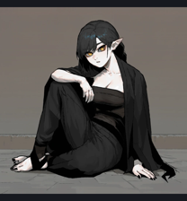
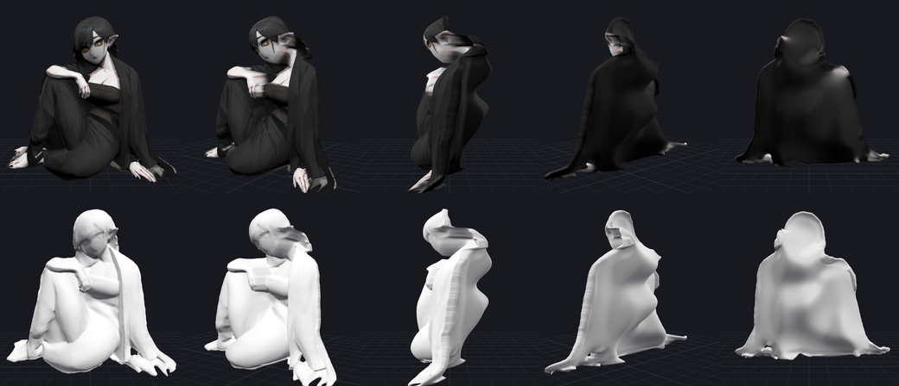

# img2mesh

Turn a single 2D image into a textured, watertight 3D model. It runs on a plain
CPU with no GPU or PyTorch needed, and takes about 15–20 seconds per image.





*Top: textured model at 0°, 35°, 90°, 140° and 180°. Bottom: the same geometry untextured.
Input: `examples/elf.webp`. Output: `examples/elf.glb`.*

## Quick start

```bash
pip install -e .            # numpy, pillow, scipy, onnxruntime, trimesh
img2mesh examples/elf.webp -o output
```

```
examples/elf.webp -> 122770 vertices, 242480 faces, size [0.885, 0.86, 0.445] (16.1s)
  glb   output/elf.glb           textured glTF (Blender, Unity, Godot, web, ...)
  obj   output/elf.obj           + elf.mtl and elf.png texture
  stl   output/elf.stl           welded, watertight solid for 3D printing
  html  output/elf_viewer.html   standalone viewer, just open it in a browser
  mask  output/elf_mask.png      the foreground cut-out that was used
  depth output/elf_depth.png     the estimated depth map
```

On the first run the default models (~570 MB) are downloaded into `~/.cache/img2mesh`
(override with `IMG2MESH_CACHE`).

## How it works

1. **Cut out the subject** with [IS-Net](https://github.com/xuebinqin/DIS) (the `isnet-anime`
   weights for illustrations, `isnet-general-use` for photos). If the image already
   has a transparent background, the alpha channel is used instead.
2. **Estimate depth** with [Depth Anything V2](https://github.com/DepthAnything/Depth-Anything-V2)
   through ONNX Runtime. The last few pixels at the outline are ignored, because
   depth networks blur the object into the background there.
3. **Build the front surface** on a regular grid from that depth. The grid outline
   is smoothed so the silhouette has no stair steps.
4. **Invent the back.** The hidden side is a smoothed copy of the front pushed back
   by an *inflation* field: `sqrt(2h)`, where `h` solves `∇²h = −1` inside the
   silhouette and is 0 on its edge. Elongated parts (arms, legs, hair strands) get
   round cross sections, so thin parts stay thin and wide parts get deep.
5. **Close the solid.** Front and back share the outline vertices, giving a single
   watertight, consistently oriented mesh (checked in the tests).
6. **Texture it.** The front uses the image. For the back, the colours seen around the
   outline are diffused inward, so the back of a head gets hair colour instead of a
   mirrored face.

## Options

| Flag | Default | Effect |
| --- | --- | --- |
| `--resolution N` | 384 | Grid cells along the long side. Higher means more detail and bigger files. |
| `--depth-scale F` | 0.35 | Depth of the front relief relative to the object's size. |
| `--thickness F` | 0.7 | How far the back bulges out (1.0 = round limbs, 0 = flat back). |
| `--front-bulge F` | 0.15 | Extra rounding of the front toward the outline. |
| `--back-smooth F` | 0.03 | How much front detail is smoothed away on the back. |
| `--depth-model` | `base` | `small` (fast, ~100 MB), `base` (~390 MB), `large` (sharpest, ~1.3 GB). |
| `--depth-resolution N` | 770 | Input size for the depth network. |
| `--segment-model` | `anime` | `anime` for drawings, `general` for photos. |
| `--mask FILE` | | Use your own mask (white = object) instead of automatic cut-out. |
| `--no-segment` | | Use the whole image, for a bas-relief of a painting or photo. |
| `--keep-all-parts` | | Keep every sizeable foreground piece, not just the largest. |
| `--back-texture` | `fill` | `fill` (outline colours), `blur` (blurred front) or `mirror` (copy the front). |
| `--formats` | all | Any of `glb,obj,stl,html`. |

Several images can be converted in one call: `img2mesh a.png b.jpg -o out`.

From Python:

```python
from pathlib import Path
from img2mesh import Options, MeshParams, convert

convert(Path("cat.jpg"), Path("out"), Options(mesh=MeshParams(thickness=1.0), segment_model="general"))
```

## Limits

This is a single-view reconstruction. The front is estimated from the image, and the
back is a plausible guess made by inflating the silhouette. Expect:

* Side and back views to be smooth and simplified, with no hidden details such as
  the back of the hair or a separate far leg.
* Stretched "curtain" surfaces where one part overlaps another at a different depth
  (for example an arm in front of the body), because each pixel has a single depth.
* Poses facing the camera to work best. Strong profile views produce thin models.

A generative multi-view model (TRELLIS, Hunyuan3D, SF3D and similar) can hallucinate
full 360° geometry, but needs a large GPU. The output formats here would suit such a
backend if one is added later.

## Development

```bash
pip install -e ".[test]"
pytest
```

The tests use synthetic shapes and do not download any models.
